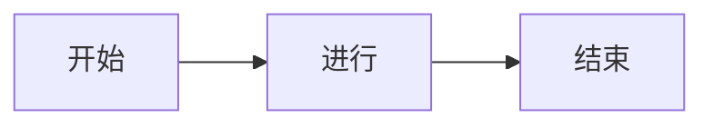
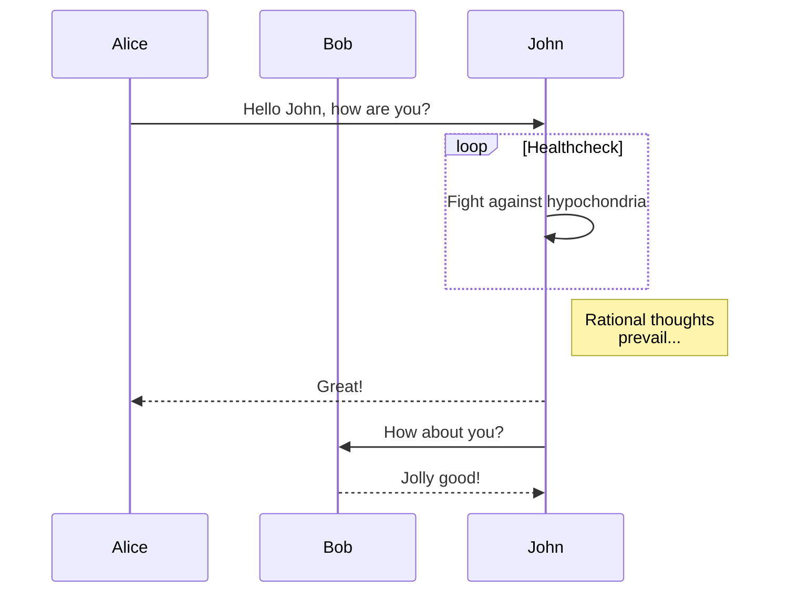
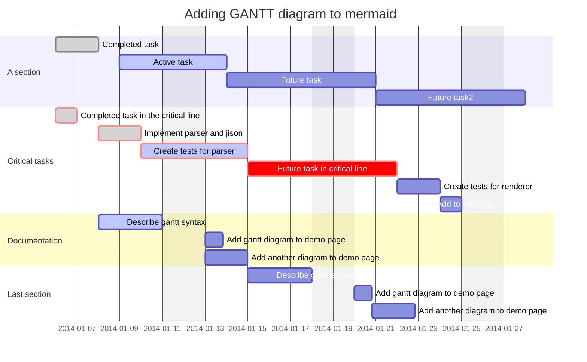

# Markdown 语法练习

## 段落和换行符

段落只是一行或多行连续的文本。在 markdown 源代码中，段落由多个空行分隔。在Typora中，您只需按下 Return 即可创建新段落。

按 Shift + Return 可创建单个换行符。但是，大多数 markdown 解析器将忽略单行中断，要使其他 markdown 解析器识别您的换行符，可以在行尾留下两个空格，或者插入 .

## 标题

### 这是三级标题

``` markdown
### 这是三级标题
```

#### 这是四级标题

``` markdown
#### 这是四级标题
```

---

## 有序列表

1. 这是有序列表
2.

```` markdown
1. 这是有序列表
2. 
````

---

## 无序列表

* 这是无序列表*号

* 这是无序列表+号

* 这是无序列表-号

```` markdown
* 这是无序列表 *号
+ +号
- -号
````

---

## 列表嵌套

* 第一层
  * 第二层
    * 第三层

```` markdown
- 第一层
  - 第二层
    - 第三层
````

---

### 任务列表（需要安装插件来自 [Markdown Checkboxes](https://github.com/mjbvz/vscode-markdown-checkboxes)）

任务列表是标记为[ ]或[x]（未完成或完成）的项目的列表。例如：

* [ ] 未完成任务列表

``` markdown
- [ ] 
```

* [x] 已完成任务列表

``` markdown
- [x] 
```

* [ ] 这是一个任务列表项
* [ ] 需要在前面使用列表的语法
* [ ] normal **formatting**, @mentions, #1234 refs
* [ ] 未完成
* [x] 完成

```markdown
- [ ] 这是一个任务列表项
- [ ] 需要在前面使用列表的语法
- [ ] normal **formatting**, @mentions, #1234 refs
- [ ] 未完成
- [x] 完成
```

您可以通过单击项目前面的复选框来更改完成/未完成状态。

---

## 引用

> 这是引用

``` markdown
> 这是引用
```

---

## 字体

**加粗**

_斜体_

~~删除线~~

``` markdown
**加粗**

_斜体_

~~删除线~~
```

---

## 高亮（markdown不支持）

==高亮==

``` markdown
==高亮==
```

---

## 链接

[链接名称](https://www.example.com)

``` markdown
[链接名称](https://www.example.com) 
```

---

## 高级链接

[链接名称][id]

[id]: https://www.example.com "可选的标题"

``` markdown
[链接名称][id]

[id]: https://www.example.com "可选的标题"
```

---

## 图片


``` markdown
 
```

---

## 高级图片

![图片名称][id]

``` markdown
![图片名称][id]

[id]: https://www.example.com/image.jpg "可选的标题"
```

---

## 脚注(markdown不支持)（脚注功能需要安装插件来自 [Markdown Footnotes](https://github.com/mjbvz/vscode-markdown-footnotes)）

这是脚注[^1]

[^1]: 脚注内容

``` markdown
这是脚注[^1]

[^1]: 脚注内容
```
---

## 上角标（markdown不支持）

X^2^（一些笔记软件支持例如[思源笔记](https://b3log.org/siyuan/)）

可用HTML标签`<sup>`或`^`表示上角标。

X<sup>2</sup>

``` markdown
X^2^
X<sup>2</sup>
```

---

## 下角标（markdown不支持）

H~2~O（一些笔记软件支持例如[思源笔记](https://b3log.org/siyuan/)）

可用HTML标签`<sub>`或`~`表示下角标。

H<sub>2</sub>O

``` markdown
H~2~O
H<sub>2</sub>O
```


---

## 注释

<!-- 这是注释 -->

``` markdown
<!-- 这是注释 -->
```

---

## 表格

| 表头1 | 表头2 | 表头3 |
| --- | --- | --- |
| 单元格1 | 单元格2 | 单元格3 |
| 单元格4 | 单元格5 | 单元格6 |

``` markdown
| 表头1 | 表头2 | 表头3 |
| --- | --- | --- |
| 单元格1 | 单元格2 | 单元格3 |
| 单元格4 | 单元格5 | 单元格6 |
```

## 表格格式对齐

| 左对齐 | 右对齐 | 居中对齐 |
| :----- | -----: | :------: |
| 左侧   | 右侧   | 居中     |

``` markdown
| 左对齐 | 右对齐 | 居中对齐 |
| :----- | -----: | :------: |
| 左侧   | 右侧   | 居中     |
```

---

## 代码块

### 行内代码块

`print("Hello, world!")`

``` markdown
`print("Hello, world!")`
```

### 代码块展示

``` python
print("Hello, world!")
```

可以做源码展示：

``` markdown  
这是代码块,可以指定特定语法markdown就是语法
```

```` markdown
``` markdown
这是代码块,可以指定特定语法markdown就是语法
      代码块```
````

---

## 转义字符

定义常用的转义字符及其对应的表示形式

| 转义字符 | 对应的表示形式 |
| --- | --- |
| \   | 反斜杠 |
| `   | 反引号 |
| *   | 星号 |
| _   | 底线 |
| {}  | 花括号 |
| []  | 方括号 |
| ()  | 括号 |
| #   | 井字号 |
| +   | 加号 |
| -   | 减号 |
| .   | 英文句点 |
| !   | 惊叹号 |

``` markdown
\   反斜杠 - 用于转义后面的字符，使其失去特殊含义。
`   反引号 - 在某些编程语言中用于标识代码块或字符串。
*   星号 - 常用于表示乘法、任意数量的字符（通配符）或强调文本（如在Markdown中）。
_   底线 - 在Markdown中用于斜体或下划线，常用于变量命名。
{}  花括号 - 用于表示代码块、字典、集合或格式化字符串。
[]  方括号 - 用于表示数组、列表或Markdown中链接的格式。
()  括号 - 用于函数调用、数学表达式或表示代码的优先级。
#   井字号 - 在Markdown中表示标题的级别。
+   加号 - 用于表示加法或连接字符串。
-   减号 - 表示减法或作为列表项的标志。
.   英文句点 - 表示小数点或类属性的分隔符。
!   惊叹号 - 在某些语法中表示非操作符或强调。
```

---

## katex公式

$$E=mc^2$$
$$p(x)=\frac{1}{\sqrt{2\pi\sigma^2}}e^{-\frac{(x-\mu)^2}{2\sigma^2}}$$

``` markdown
$$E=mc^2$$
$$p(x)=\frac{1}{\sqrt{2\pi\sigma^2}}e^{-\frac{(x-\mu)^2}{2\sigma^2}}$$
```

katex公式的语法参考：<https://katex.org/docs/supported.html>
---

## mathjax公式

$$\begin{align*}
\dot{x} & = \sigma(y-x) \\
\dot{y} & = \rho x - y - xz \\
\dot{z} & = -\beta z + xy
\end{align*}$$

``` markdown
$$\begin{align*}
\dot{x} & = \sigma(y-x) \\
\dot{y} & = \rho x - y - xz \\
\dot{z} & = -\beta z + xy
\end{align*}$$
```
mathjax公式的语法参考：https://docs.mathjax.org/en/v2.7-latest/tex.html
---
## latex公式(markdown不支持)

\begin{align*}<br/>
\dot{x} & = \sigma(y-x) \\<br/>
\dot{y} & = \rho x - y - xz \\<br/>
\dot{z} & = -\beta z + xy<br/>
\end{align*}

``` markdown
\begin{align*}
\dot{x} & = \sigma(y-x) \\
\dot{y} & = \rho x - y - xz \\
\dot{z} & = -\beta z + xy
\end{align*}
```
latex公式的语法参考：https://www.latex-project.org/help/documentation/
---

## 支持的HTML标签
目前支持的HTML标签有：

- `<a>`：超链接
- ``：图片
- `<br>`：换行
- `<hr>`：水平线
- `<ol>`：有序列表
- `<ul>`：无序列表
- `<li>`：列表项
- `<strong>`：加粗
- `<em>`：斜体
- `<del>`：删除线
- `<sub>`：下角标
- `<sup>`：上角标
- `<code>`：代码
- `<pre>`：预格式化文本
- `<blockquote>`：块引用
- `<h1>` - `<h6>`：标题
- `<p>`：段落
- `<span>`：内联样式
- `<div>`：块级元素
- `<table>`：表格
- `<thead>`：表头
- `<tbody>`：表体
- `<tr>`：表行
- `<th>`：表头单元格
- `<td>`：表格单元格
- `<kbd>`：键盘输入

上述代码举例如下：

<a href="https://www.example.com">链接名称</a>


<br>
<hr>
<ol>
  <li>第一项</li>
  <li>第二项</li>
  <li>第三项</li>
</ol>
<ul>
  <li>第一项</li>
  <li>第二项</li>
  <li>第三项</li>
</ul>
<strong>加粗</strong><br>
<em>斜体</em><br>
<del>删除线</del><br>
参考<sub>下角标</sub><br>
参考<sup>上角标</sup><br>
<code>代码</code><br>
<br>
<pre>预格式化文本</pre><br>
<blockquote>
  块引用
</blockquote><br>
<h1>标题1</h1>
<h2>标题2</h2>
<h3>标题3</h3>
<h4>标题4</h4>
<h5>标题5</h5>
<h6>标题6</h6>
<p>段落</p>
<span style="color:red">红色</span>
<div>块级元素</div>
<table>
  <thead>
    <tr>
      <th>表头1</th>
      <th>表头2</th>
      <th>表头3</th>
    </tr>
  </thead>
  <tbody>
    <tr>
      <td>单元格1</td>
      <td>单元格2</td>
      <td>单元格3</td>
    </tr>
    <tr>
      <td>单元格4</td>
      <td>单元格5</td>
      <td>单元格6</td>
    </tr>
  </tbody>
</table>
<kbd>Ctrl</kbd>+<kbd>Alt</kbd>+<kbd>Del</kbd><br><br>

``` markdown
<a href="https://www.example.com">链接名称</a>


<br>
<hr>
<ol>
  <li>第一项</li>
  <li>第二项</li>
  <li>第三项</li>
</ol>
<ul>
  <li>第一项</li>
  <li>第二项</li>
  <li>第三项</li>
</ul>
<strong>加粗</strong><br>
<em>斜体</em><br>
<del>删除线</del><br>
<code>代码</code><br>
<br>
<pre>预格式化文本</pre><br>
<blockquote>
  块引用
</blockquote><br>
<h1>标题1</h1>
<h2>标题2</h2>
<h3>标题3</h3>
<h4>标题4</h4>
<h5>标题5</h5>
<h6>标题6</h6>
<p>段落</p>
<span style="color:red">红色</span>
<div>块级元素</div>
<table>
  <thead>
    <tr>
      <th>表头1</th>
      <th>表头2</th>
      <th>表头3</th>
    </tr>
  </thead>
  <tbody>
    <tr>
      <td>单元格1</td>
      <td>单元格2</td>
      <td>单元格3</td>
    </tr>
    <tr>
      <td>单元格4</td>
      <td>单元格5</td>
      <td>单元格6</td>
    </tr>
  </tbody>
</table>
<kbd>Ctrl</kbd>+<kbd>Alt</kbd>+<kbd>Del</kbd><br><br>
```
## markdown使用Emoji表情
有两种方法可以插入Emoji表情：

1. 使用Unicode编码：在markdown编辑器中输入对应的Unicode编码，如：`&#x1F600;`，&#x1F600;即可插入一个笑脸。

2. 使用Emoji语法：在markdown编辑器中输入`:smile:`，:smile:即可插入一个笑脸。(需要在VSCode中安装Emoji插件才能预览)([Markdown Emmoji](https://github.com/mjbvz/vscode-markdown-emoji))

Emoji语法参考：https://www.webpagefx.com/tools/emoji-cheat-sheet/

使用表情符号简码
一些Markdown应用程序允许您通过键入表情符号短代码来插入表情符号。
这些以冒号开头和结尾，并包含表情符号的名称。

去露营了！ :tent: 很快回来。

真好笑！ :joy:
``` markdown
去露营了！ :tent: 很快回来。

真好笑！ :joy:
```
canvas绘制的表情符号
一些Markdown应用程序允许您通过键入表情符号短代码来插入表情符号。
这些以冒号开头和结尾，并包含表情符号的名称。

:art: :apple: :birthday: :car: :cat: :dog: :elephant: :fire: :fish: :frog: :hat: :heart: :icecream: :monkey: :moon: :mountain: :octopus: :pizza: :rabbit: :santa: :school: :snowflake: :sparkler: :star: :sun: :tiger: :watermelon: :wink: :zap:

``` markdown
:art: :apple: :birthday: :car: :cat: :dog: :elephant: :fire: :fish: :frog: :hat: :heart: :icecream: :monkey: :moon: :mountain: :octopus: :pizza: :rabbit: :santa: :school: :snowflake: :sparkler: :star: :sun: :tiger: :watermelon: :wink: :zap:
```
---
## 流程图（VSCode markdown预览不支持）（需要安装插件来自 mermaid）（[Markdown Preview Mermaid Support](https://github.com/mjbvz/vscode-markdown-mermaid)）



``` markdown

---

## 时序图（VSCode markdown预览不支持）（需要安装插件来自 mermaid）（[Markdown Preview Mermaid Support](https://github.com/mjbvz/vscode-markdown-mermaid)）



``` markdown

---

## 甘特图（VSCode markdown预览不支持）（需要安装插件来自 mermaid）（[Markdown Preview Mermaid Support](https://github.com/mjbvz/vscode-markdown-mermaid)）



``` markdown

---
